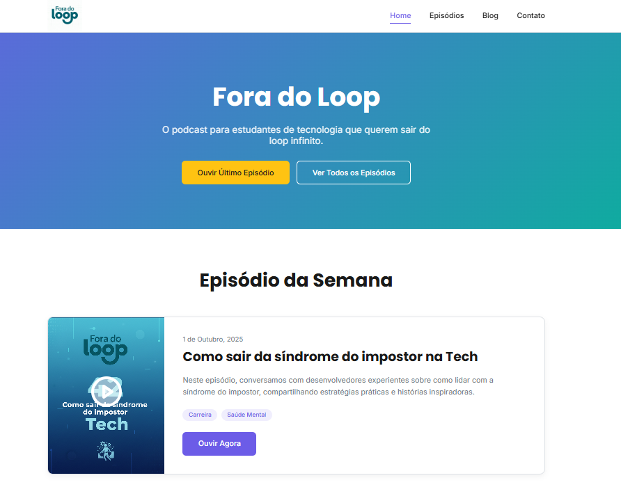

# 🎧 Fora do Loop - Website do Podcast


<br>

<p align="center">
  
</p>

## 📝 Descrição

Este é o site oficial do "Fora do Loop", um podcast de tecnologia focado em estudantes e iniciantes na área que buscam sair do ciclo infinito de tutoriais e construir uma carreira sólida. O site serve como uma plataforma central para ouvir episódios, ler artigos no blog e entrar em contato com a equipe.

Este projeto foi desenvolvido como parte de um trabalho acadêmico, com foco em criar uma página em HTML e CSS. Busquei acrescentar uma experiência de usuário limpa, moderna e totalmente responsiva, utilizando boas práticas de desenvolvimento web.

## ✨ Funcionalidades

- **Página Inicial Dinâmica:** Apresenta o episódio mais recente em destaque e informações sobre patrocinadores.
- **Catálogo de Episódios:** Uma página dedicada a todos os episódios, com um campo de busca funcional (interface).
- **Blog Informativo:** Seção com artigos para aprofundar os temas discutidos no podcast.
- **Formulário de Contato:** Uma maneira direta para ouvintes e parceiros entrarem em contato.
- **Design Responsivo:** A interface se adapta perfeitamente a desktops, tablets e smartphones.
- **Componentização com JavaScript:** O cabeçalho e o rodapé são carregados dinamicamente, evitando repetição de código e facilitando a manutenção.
- **Animações de Scroll:** Efeitos sutis de animação são aplicados aos elementos conforme o usuário rola a página, melhorando a experiência visual.

## 🚀 Tecnologias Utilizadas

Este projeto foi construído com as seguintes tecnologias:

- **HTML5:** Para a estruturação e semântica do conteúdo.
- **CSS3:** Para estilização, layout (Flexbox, Grid) e responsividade.
- **JavaScript (Vanilla):** Para manipulação do DOM, carregamento de componentes e interatividade do menu mobile.
- **AOS (Animate On Scroll) Library:** Para implementar as animações de rolagem.

## 📁 Estrutura do Projeto

O projeto está organizado da seguinte forma:

```
├── assets/              # Contém imagens e logos
├── css/
│   └── style.css        # Folha de estilo principal
├── js/
│   └── main.js          # Script principal (carrega componentes, menu, etc.)
├── _header.html         # Componente do cabeçalho
├── _footer.html         # Componente do rodapé
├── index.html           # Página Inicial
├── episodios.html       # Página de Episódios
├── blog.html            # Página do Blog
├── contato.html         # Página de Contato
└── README.md            # Este arquivo
```

## ▶️ Como Executar

Por ser um projeto web estático, você não precisa de um ambiente de desenvolvimento complexo para executá-lo.

1.  Clone este repositório: `git clone https://github.com/douglasgalhardo/Fora-do-Loop.git`
2.  Navegue até a pasta do projeto.
3.  Abra o arquivo `index.html` diretamente no seu navegador.

**Recomendação:** Para uma melhor experiência e para garantir que o `fetch()` do JavaScript (que carrega o header e footer) funcione corretamente sem erros de CORS, recomendo usar um servidor local. A forma mais fácil é com a extensão **Live Server** no Visual Studio Code.

## 👨‍💻 Autor

Desenvolvido por **Douglas Galhardo**.

- **LinkedIn:** [https://www.linkedin.com/in/douglasgalhardo/](https://www.linkedin.com/in/douglasgalhardo/)
- **GitHub:** [https://github.com/douglasgalhardo](https://github.com/douglasgalhardo)

---
